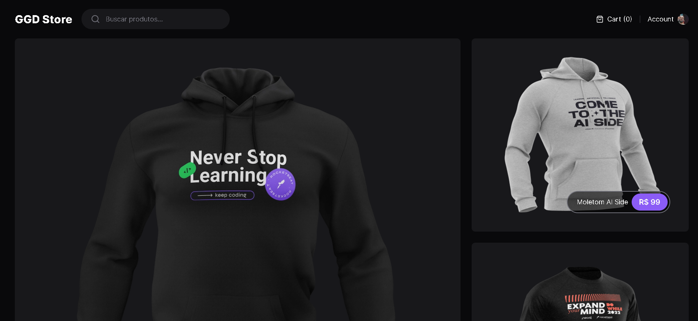

# GG Store Web

<div align="center">
	
</div>

## :dart: Objetivo

Projeto desenvolvido com fins de estudo, aplicando novos conceitos e
funcionalidades das novas features do Next.js.

## :hammer_and_wrench: Ferramentas

- [cypress](https://www.cypress.io/)
- [lucide-react](https://lucide.dev/)
- [next.js](https://nextjs.org/)
- [tailwindcss](https://tailwindcss.com/)
- [typescript](https://www.typescriptlang.org/)
- [zod](https://zod.dev/)

## :desktop_computer: Padronização de código

- [EditorConfig](https://editorconfig.org/)
- [Eslint](https://eslint.org/)
- [Prettier](https://prettier.io/)

## :rocket: Executando o projeto

```bash
// Instale as dependências

npm i

// Concluindo a instalação rode

npm run dev
```
